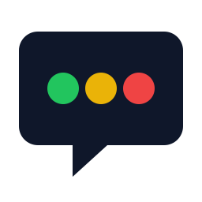

<p align="center">
  
</p>

# status-page-to-chat

A small self-hosted service that monitors the status pages of external providers and posts new incidents and their resolutions to **Google Chat** or **Microsoft Teams**.

Designed to be cheap and forgettable: a single Docker container, SQLite for state, a webhook URL as the only required secret. Adapter types for Atlassian Statuspage, Google Workspace, WEDOS, GitHub Issues, BetterStack RSS, Hund.io Atom, Zendesk SSP and a generic HTML scraper cover dozens of services — you wire up the ones you care about after the container is running.

---

## Quick deploy (3 minutes)

You need a Docker host. Anywhere will do — a Synology, a Raspberry Pi, a small VM, your laptop while you try it out.

1. **Get a webhook URL** for your chat target (Google Chat: channel `⋮` → Apps & integrations → Webhooks; Teams: channel `…` → Workflows → "Post to a channel when a webhook request is received"). Copy the URL.
2. **Deploy with zero providers configured**:

   ```bash
   mkdir status-page-to-chat && cd status-page-to-chat
   curl -O https://raw.githubusercontent.com/gzuercher/status-page-to-chat/main/docker-compose.yml
   cat > .env <<EOF
   WEBHOOK_URL=https://chat.googleapis.com/v1/spaces/...
   API_TOKEN=$(openssl rand -hex 32)
   EOF
   chmod 600 .env
   docker compose up -d
   ```

   That's literally it. The container brings its own empty `providers.yaml` and seeds it into the data volume on first start. Logs show `providerCount: 0` and quiet poll cycles. No webhook traffic until you add at least one provider. `API_TOKEN` is the bearer credential for the management API — save the value somewhere safe.

3. **Add the services you want to watch**. Two ways:

   - **Use the management API** — `PUT /api/providers/<key>` with a small JSON body. Easiest from a chat-driven LLM assistant; see [docs/LLM-INTEGRATION.md](docs/LLM-INTEGRATION.md). `curl` examples in [docs/API.md](docs/API.md).
   - **Edit the file directly** — `docker compose cp status-poller:/data/providers.yaml ./providers.yaml`, edit, `docker compose cp ./providers.yaml status-poller:/data/providers.yaml`. The next poll cycle (within 5 min) picks it up automatically.

4. **Watch the logs**: `docker compose logs -f` — you should see `Configuration loaded`, `Poller scheduled`, and a `run_summary` line within ~30 seconds.

5. **Update later**: `docker compose pull && docker compose up -d`.

That's it. No cloud account, no fork, no infrastructure setup. Adding providers happens after the container is already running, not before.

## How it works

1. A long-running Node.js process polls every 5 minutes.
2. For each configured service, the status page is queried via the appropriate **adapter** (see [docs/ADAPTERS.md](docs/ADAPTERS.md) for the full list).
3. New or newly resolved incidents are compared against the last known state (SQLite).
4. On state change, a message is posted via webhook. Three output formats (`chatTarget`):
   - **`teams`** — a finished, localised Adaptive Card (colour-coded red/green, status badge, optional service description; incident titles machine-translated via the Claude API when `ANTHROPIC_API_KEY` is set).
   - **`googleChat`** — a Google Chat Card v2 (English).
   - **`teamsJson`** — the raw normalized event as JSON (stable schema, `schemaVersion: 3`); a downstream renderer such as an Azure Logic App builds the card centrally. See [docs/CONFIGURATION.md](docs/CONFIGURATION.md).

## Configuration

The container seeds an empty `providers.yaml` into its named data volume on first start (template baked into the image). Edit the live file via the REST API or `docker compose cp` — the next poll cycle (max 5 min) picks up changes automatically. If an edit produces invalid YAML, the container keeps running on the previous configuration and logs a warning, so a typo never takes the service down.

If you prefer a host-side bind mount (so you can edit `providers.yaml` in your usual editor), add a `docker-compose.override.yml` next to the compose file:

```yaml
services:
  status-poller:
    volumes:
      - ./providers.yaml:/data/providers.yaml:rw
```

Then `docker compose cp status-poller:/data/providers.yaml ./providers.yaml` once to extract the seeded default, and `docker compose up -d` again. Subsequent edits live on the host.

For schema details and per-adapter options see [docs/CONFIGURATION.md](docs/CONFIGURATION.md).

**Advanced — bake config into the image (fork-based workflow):** edit `config/providers.yaml` in a fork, push, let CI build a tagged image, point your stack at it. Useful only if you want config to be version-controlled in Git. For most operators, editing `providers.yaml` on the host is simpler.

Environment variables you can set:

| Variable | Default | Purpose |
|---|---|---|
| `WEBHOOK_URL` | required | Google Chat webhook, Teams (Workflows) webhook, or — for `teamsJson` — the JSON-consuming endpoint (e.g. a Logic App HTTP trigger) |
| `CHAT_TARGET` | from `providers.yaml` | Overrides the configured chat target (`googleChat` \| `teams` \| `teamsJson`) |
| `LANGUAGE` | `de` | UI language of the Teams cards (`de` \| `en`) |
| `ANTHROPIC_API_KEY` | — | Claude API key; when set, Teams incident titles are machine-translated |
| `TRANSLATE_MODEL` | `claude-haiku-4-5-20251001` | Claude model used for translation |
| `API_TOKEN` | — | Bearer token for the management API. Required unless `API_AUTH_DISABLED=true`. |
| `API_AUTH_DISABLED` | — | Set to literal `true` to disable API auth (only on trusted networks) |
| `API_PORT` | `8080` | Port the management API listens on |
| `CONFIG_PATH` | `/data/providers.yaml` (in compose) | Path to the providers config |
| `STATE_DB_PATH` | `/data/state.sqlite` | SQLite file location |
| `POLL_CRON` | `*/5 * * * *` | When the poller runs |
| `REPORTS_SCHEDULER` | _(unset)_ | Set to `external` when host cron triggers the periodic reports via the `report` subcommand. Leaving the built-in scheduler on as well sends every report twice. |
| `LOG_LEVEL` | `info` | pino log level |
| `USER_AGENT` | `status-page-to-chat/<version> (+<repo>)` | Override the outbound User-Agent (e.g. add a contact address) |
| `HEALTH_MAX_AGE_SECONDS` | `900` | Healthcheck threshold — container is reported unhealthy if no poll completed within this window |

## Configure via chat

You can hand over day-to-day maintenance — adding, removing, and inspecting providers — to a backoffice colleague who never touches the host. The container ships an OpenAPI-described REST API; point any OpenAPI-aware LLM platform at it (Langdock, ChatGPT Custom GPTs, OpenWebUI, your own assistant) and they manage the watch list in natural language. See [docs/LLM-INTEGRATION.md](docs/LLM-INTEGRATION.md) for platform-specific setup walkthroughs and [docs/API.md](docs/API.md) for the underlying endpoints.

## Documentation

| Document | Content |
|---|---|
| [docs/ARCHITECTURE.md](docs/ARCHITECTURE.md) | Architecture, modules, data flow |
| [docs/CONFIGURATION.md](docs/CONFIGURATION.md) | Format of `providers.yaml` and env vars |
| [docs/ADAPTERS.md](docs/ADAPTERS.md) | Specification per status page adapter |
| [docs/DEPLOYMENT.md](docs/DEPLOYMENT.md) | Three deployment paths: plain Docker via SSH, Portainer stack, local laptop |
| [docs/API.md](docs/API.md) | Management API reference with `curl` examples |
| [docs/LLM-INTEGRATION.md](docs/LLM-INTEGRATION.md) | Chat-based maintenance via any OpenAPI-aware LLM platform |

## Development

```bash
pnpm install
pnpm build
pnpm test
WEBHOOK_URL='https://webhook.site/<your-slot>' STATE_DB_PATH=./data/state.sqlite pnpm start
```

Requirements: Node.js 22.19+, pnpm (via `corepack enable`). Optional: Docker for container work.

## Shipping a change

One step: **open a Pull Request and merge it.** Everything else (Docker build, image push to GHCR, `:latest` tag update) runs automatically — see [CONTRIBUTING.md](CONTRIBUTING.md).

## License

MIT — see [LICENSE](LICENSE). Use, fork, modify, redeploy as you wish.
